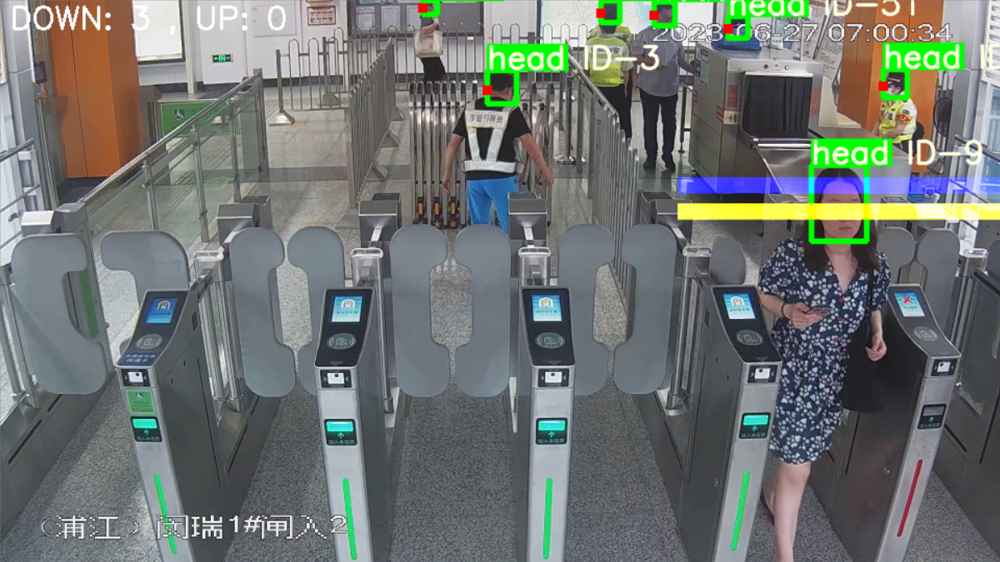

# Yolov5 DeepSORT 实现地铁口闸机计数



> 原仓库链接：https://github.com/dyh/unbox_yolov5_deepsort_counting

# 一、环境配置

建议使用 Anaconda 虚拟环境：

```shell
conda create -n yolo_deepsort python=3.8 
conda activate yolo_deepsort
```

安装相关依赖：

```shell
# pytorch(实测1.10.2也可以)
pip install torch==1.7.1+cu110 torchvision==0.8.2+cu110 torchaudio===0.7.2 -f https://download.pytorch.org/whl/torch_stable.html

# 安装依赖包
pip install -r requirements.txt
```

# 二、运行说明

1. main_modify.py 用于 x86 平台的闸机人员计数
2. main_on_xavier.py 用于 Xavier (arm) 平台的闸机人员计数

# 三、在 x86 平台构建和运行镜像

x86 平台可以使用镜像部署。

## 3.1 准备工作

构建和运行镜像前先获取 root 权限：

```shell
sudo su
```
## 3.2 构建镜像

Dockerfile在Docker文件夹下，进入该文件夹然后：
```shell
docker build -t tongkai2023/yolov5_deepsort:latest
```
或者从 dockerhub 拉取构建好的镜像：
```shell
docker pull tongkai2023/yolov5_deepsort:latest
```
## 3.3 运行镜像

1、打开x服务器访问控制：

```shell
xhost +
```
2、**创建并运行**容器，需要把下面命令中的`[人员计数代码根目录]`，换成主机里的人员计数代码的根目录，例如：/home/seu/tongkai/yolo_deepsort/unbox_yolov5_deepsort_counting，注意此路径中不得含中文或者空格：

```shell
docker run -it \
--ipc=host \
--env="DISPLAY" \
--gpus=all \
-e PYTHONUNBUFFERED=1 \
-e QT_X11_NO_MITSHM=1 \
-e PYTHONIOENCODING=utf-8 \
--mount type=bind,src=/tmp/.X11-unix,dst=/tmp/.X11-unix \
-v [人员计数代码根目录]:/home/yolo_deepsort \
-p "8888:8888" \
tongkai2023/yolov5_deepsort:latest \
bash
```
参数说明：
1. 用于显示图形界面的参数：
	- `--ipc=host`：将容器的IPC命名空间设置为与主机共享，这允许容器与主机上的进程进行IPC通信。
	- `--env="DISPLAY"`：设置容器中的图形应用程序将其图形界面显示到主机上的X服务器。
	- `-e QT_X11_NO_MITSHM=1`：用于解决容器向主机发送图形界面时的某些bug。
	- `--mount type=bind,src=/tmp/.X11-unix,dst=/tmp/.X11-unix`创建了一个挂载点，将主机的`/tmp/.X11-unix`目录绑定到容器内的`/tmp/.X11-unix`目录。这是为了允许容器中的图形应用程序与主机上的X11服务器进行通信。
2. 其他参数：
	- `--gpus=all`：允许容器访问所有的GPU资源。这要求主机上已经安装了NVIDIA的GPU驱动和Docker GPU支持。
	- `-e PYTHONUNBUFFERED=1`，解决代码print中文时的某些bug。
	- `-v [人员计数代码根目录]:/home/yolo_deepsort`：将主机的代码目录挂载到容器内的`/home/yolo_deepsort`下。
	- `-p "8888:8888"`：指定容器的端口。

3、修改代码

main_x86.py：

```python
70 # 打开视频
71 video_name = 'NVR-1_1_Trim.avi'  # 这里填入自己的视频名称
72 capture = cv2.VideoCapture(os.path.join('./video', video_name))  # 这里填入视频的文件夹位置
```

detector.py：

```python
 61                   if lbl not in ['head']:  # 修改标签，可选person(全身), head(头部)
 62                       continue
```

4、准备权重

下载权重文件[crowdhuman_yolov5m.pt](https://pan.baidu.com/s/1JB2JBQM8_iPq936xAKdQPg?pwd=3qtg) (提取码: 3qtg)，并把该文件放到 weights目录下。


5、运行代码进行测试：

```shell
python main_x86.py
```

# 四、Arm 平台的部署说明

AGX的CPU(armv8)处理速度慢，出现卡死，解决方法是，修改接收rtsp流的线程代码为：
```python
def Receive():
    print("start Reveive")
    cap = cv2.VideoCapture("your/rtsp/path")
    ret, frame = cap.read()
    q.put(frame)
    while ret:
        ret, frame = cap.read()
        if frame is not None and q.qsize() < 3:  # q是queue.Queue(maxsize=3)，如果队列长度小于三，说明另一个线程读取完毕
            q.put(frame)
        else:
            time.sleep(0.01)
```

其中主要修改了判断条件，`if frame is not None and q.qsize() < 3` 里的 `q.qsize() < 3`，以确保另一个处理图像的线程已经读走了一帧，此时再put进新的视频帧；否则等待0.01秒。

经过以上修改后，代码可以在arm平台上正常运行。